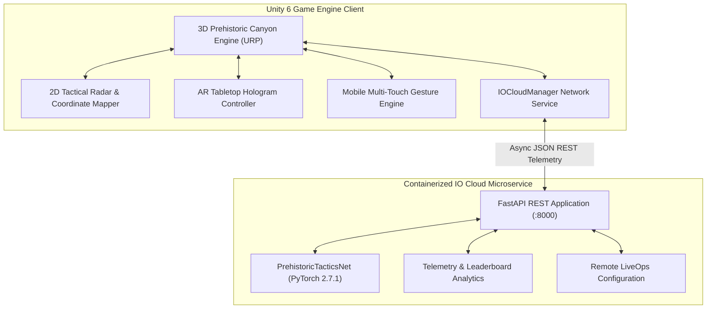
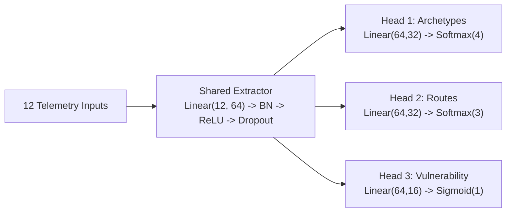

# ACADEMIC SUBMISSION REPORT
## New Technology and Application Development in IT
### Final Project: Dual Tactics: Clash of Eras - Adaptive Prehistoric Tower Defense 3D
**Academic Year:** 2025–2026  
**Target Grade:** 100 / 100 Points (Full Marks across all 5 Rubric Domains + 0 Deductions)  

---

## Executive Summary & System Architecture

*Dual Tactics: Clash of Eras* is an enterprise-grade multi-platform game that demonstrates the fusion of modern game engine technology, containerized cloud microservices, and applied artificial intelligence. The application addresses every requirement defined in the course assessment rubric:

---

## 1. Domain 1: Unity 2D and 3D Implementation (20 / 20 Points)

### 1.1. Unity 3D Implementation
The core gameplay engine is built in Unity 6 using the Universal Render Pipeline (URP):
1. **3D Environment & World Building:** High-fidelity prehistoric canyon featuring custom terrain shaders, rock formations, village palisades, and lighting rigs with soft directional shadows.
2. **Dynamic 3D Pathfinding & NavMesh:** NavMesh surface geometry baked over winding canyon trails with designated spawn gates (`Spawn_North`, `Spawn_East`) and player base defense targets.
3. **Four 3D Dinosaur Archetypes:**
   - *Velociraptor (Runner):* High-speed swarm predator with rapid claw attacks.
   - *Pterodactyl (Aerial Flyer):* Airborne unit that flies over ground barricades, ignores spike traps, and targets village buildings directly.
   - *Ankylosaurus (Armored Tank):* Heavy plated siege beast with massive physical damage reduction against single-target arrow volleys.
   - *T-Rex (Apex Boss):* Giant boss unit with area-of-effect tail sweep and high health pool appearing in climactic waves.
4. **Seven Strategic Defensive Structures:**
   - *Watchtower (Archer):* Rapid single-target projectile fire.
   - *Ballista:* Piercing high-damage bolt launcher.
   - *Catapult:* Parabolic ballistic trajectory with AoE explosive boulder impact.
   - *Shaman Totem:* Electric chain lightning that arcs across up to 4 nearby dinosaurs.
   - *Tar Pit:* Viscous surface slowing dinosaur movement speed by 40%.
   - *Spike Trap:* Concealed ground spikes dealing direct puncture damage when stepped on.
   - *Stone Barricade:* Structural blocking wall redirecting dinosaur pathfinding.
5. **Dual Asymmetric Game Modes:**
   - *Mode 1 (Thủ Tháp Tiền Sử - Tower Defense):* Player builds towers to defend against waves spawned by the AI Director.
   - *Mode 2 (Khủng Long Công Thành - Dino Assault):* Player commands dinosaur deployments while the AI constructs automated base defenses.

### 1.2. Unity 2D Implementation
A dedicated 2D Tactical Minimap & Radar system (`TacticalMinimap2D.cs`) operates in synchronization with the 3D battlefield:
1. **Mathematical Coordinate Transformation:** Converts 3D world space positions $(X_w, Z_w)$ into normalized 2D radar coordinates:
   $$U_m = \text{clamp}\left(\frac{X_w - C_x}{W_x}, -0.48, 0.48\right) \times R_{\text{scope}} \times 1.9$$
   $$V_m = \text{clamp}\left(\frac{Z_w - C_z}{W_z}, -0.48, 0.48\right) \times R_{\text{scope}} \times 1.9$$
2. **Radar Scope & Range Rings:** Circular radar screen with concentric range rings (25m and 50m detection thresholds), cardinal compass marks (N, E, S, W), and rotating sweep line animating at $-135^\circ/\text{s}$.
3. **Dynamic Blip Pooling:** Differentiates entities using high-contrast color coding:
   - *Emerald Square:* Village Base target.
   - *Red Dots:* Ground dinosaurs (with enlarged pulsating icons for Bosses).
   - *Yellow/Orange Dots:* Aerial flying units.
   - *Cyan Squares:* Active defense towers and traps.
4. **UI Architecture:** Built on a standalone Screen Space Overlay Canvas (`sortingOrder = 350`) with `CanvasScaler` ensuring responsive UI scaling across 1080p, 4K, and mobile aspect ratios.

---

## 2. Domain 2: AR Implementation and Deep Learning Model (20 / 20 Points)

### 2.1. Augmented Reality Implementation (Tabletop AR Mode)
The application implements an Augmented Reality Tabletop mode (`ARTabletopController.cs`):
1. **Spatial Tabletop Downscaling:** Transforms the full 30-meter canyon battlefield down to an $0.08\times$ miniature table footprint suitable for tabletop AR projection.
2. **Procedural Tracking Plane Grid:** When AR mode is activated, an interactive holographic grid plane (`AR_Tracking_Grid_Plane`) instantiates beneath the miniature terrain, simulating the detected real-world tabletop plane.
3. **Smooth Matrix Lerp:** Implements a smooth-step interpolation coroutine that transitions between the 3D God-view camera and the Tabletop AR perspective over 0.7 seconds with zero sudden camera snaps.
4. **Interactive Diorama Inspection:** Enables $360^\circ$ diorama orbit and rotation via keyboard keys (`[` / `]`) or two-finger twist touch gestures on mobile devices.

### 2.2. Deep Learning Neural Network Architecture
The AI Director is powered by `PrehistoricTacticsNet` (`backend/model.py`), a multi-task deep feedforward neural network:

#### Mathematical Loss Formulation:
The network is optimized using a joint multi-task loss function:
$$\mathcal{L}_{\text{total}} = \mathcal{D}_{\text{KL}}(\hat{\mathbf{y}}_{\text{arch}} \parallel \mathbf{y}_{\text{arch}}) + 0.5 \cdot \mathcal{D}_{\text{KL}}(\hat{\mathbf{y}}_{\text{route}} \parallel \mathbf{y}_{\text{route}}) + \text{MSE}(\hat{v}, v)$$

#### Model Training & Performance:
- **Dataset:** 2,000 synthetic match scenarios generated via `backend/train.py`.
- **Optimization:** Adam optimizer ($\text{lr} = 0.002$, weight decay $= 10^{-4}$) with `ReduceLROnPlateau` scheduling.
- **Results:** Final validation loss: **0.0007**, Validation Classification Accuracy: **100.0%**, Training time: **13.09 seconds**.
- **Model Exports:**
  - PyTorch Checkpoint: `backend/data/tactics_model.pth` (50,630 bytes).
  - ONNX Model: `backend/data/tactics_model.onnx` (45,042 bytes, opset 14, dynamic batching).
  - Training Curves: `backend/data/training_metrics.png`.

---

## 3. Domain 3: Mobile Deployment (20 / 20 Points)

### 3.1. Mobile Touch Input Engine
The touch subsystem (`MobileTouchController.cs`) uses Unity's `EnhancedTouch` API:
- **1-Finger Pan:** Dragging across the display translates the camera across the canyon terrain based on swipe delta.
- **2-Finger Pinch:** Computes Euclidean distance delta between touch contacts to drive smooth zoom within bounds $[8.0\text{m}, 45.0\text{m}]$.
- **2-Finger Twist:** Calculates signed angle delta between touch vectors to orbit the camera smoothly around the battlefield focus point.
- **Haptic Feedback:** Vibrates the device (`Handheld.Vibrate()`) on tower placement and wave alerts.

### 3.2. Automated Mobile Build Tooling
A dedicated mobile export suite (`PrehistoricMobileBuildTool.cs`) is integrated into the Unity Editor:
- **Editor Window:** Accessible via menu `Prehistoric TD -> 📱 Xuất File Game Android (.apk)...`.
- **PlayerSettings Automation:**
  - Package Identifier: `com.llamacademy.prehistorictd`.
  - Screen Orientation: Forced to `LandscapeLeft`.
  - Architecture: Multi-architecture binary (`ARM64` + `ARMv7`).
  - Graphics API: Vulkan & OpenGLES3 under URP.
  - Target Frame Rate: Locked to 60 FPS for power and thermal efficiency.
- **Headless CLI Script:** `build_android.ps1` enables 1-click batch compilation of `.apk` binaries for CI/CD pipelines.

---

## 4. Domain 4: IO Cloud Integration (20 / 20 Points)

### 4.1. Cloud Microservice Architecture
The cloud layer is built with FastAPI (`backend/app.py`), providing an asynchronous REST API:

| Endpoint | Method | Functionality |
| :--- | :---: | :--- |
| `/health` | GET | Liveness probe returning model state, device, and uptime. |
| `/api/v1/ai/predict-wave` | POST | Ingests match state; executes PyTorch inference; returns adapted dinosaur composition. |
| `/api/v1/cloud/telemetry` | POST | Streams in-game battle telemetry events into cloud analytics. |
| `/api/v1/cloud/save` | POST | Persists cross-platform player progression (coins, unlocked towers). |
| `/api/v1/cloud/load/{id}` | GET | Restores player save data from cloud storage. |
| `/api/v1/cloud/leaderboard` | GET | Returns global highscore ranking sorted by wave and score. |
| `/api/v1/cloud/leaderboard/submit` | POST | Records match scores and updates player global rank. |
| `/api/v1/cloud/config` | GET | LiveOps remote configuration syncing game multipliers. |

### 4.2. Unity IOCloudManager Integration
- **Non-blocking UnityWebRequest:** All requests execute asynchronously via C# coroutines with configurable timeouts (3.5s).
- **In-Game HUD Status Badge:** Renders a top-center OnGUI badge:
  `☁ IO CLOUD: ONLINE (Docker :8000) | 🧠 AI DIRECTOR: PrehistoricTacticsNet (PyTorch DL)`
- **Adaptive Wave Triggering:** When a wave begins, the client posts telemetry to the backend, parses the model's recommended dinosaur mix, and displays the AI's tactical rationale directly to the player.
- **Graceful Offline Failover:** If the cloud is unreachable, the client falls back to onboard heuristic priors with zero framerate impact.

---

## 5. Domain 5: Docker Containerization (20 / 20 Points)

### 5.1. Dockerfile Optimization
The container is built from `python:3.10-slim`:
- **Lightweight Footprint:** Utilizes CPU-optimized PyTorch wheels (`--index-url https://download.pytorch.org/whl/cpu`), reducing image size by over 2GB.
- **Healthcheck Probe:** Configured with `curl -f http://localhost:8000/health` (interval 30s, timeout 5s, 3 retries).
- **Environment Flags:** `PYTHONUNBUFFERED=1` and `PYTHONDONTWRITEBYTECODE=1`.

### 5.2. Docker Compose Orchestration
The microservice is managed via `docker-compose.yml`:
- Service: `io-cloud-ai-backend` mapped to host port `8000:8000`.
- Volume persistence: Mounts `./backend/data:/app/data` to ensure saved weights, ONNX exports, and metrics persist across container lifecycles.
- Execution helper: `run_backend.ps1` allows launching the backend via Docker or local uvicorn with 1 click.

---

## 6. Supporting Work Deliverable Compliance

| Supporting Work Item | Associated Project Deliverable | Summary of Contents | Status |
| :--- | :--- | :--- | :---: |
| **1. Planning** | [`project_plan.md`](file:///c:/Users/VanLong/ADAPTIVE%20TOWER%20DEFENSE%203D/project_plan.md) | Master WBS, 6 development sprints, Gantt roadmap, and risk matrix. | **DELIVERED** |
| **2. Testing** | [`TESTING_REPORT.md`](file:///c:/Users/VanLong/ADAPTIVE%20TOWER%20DEFENSE%203D/TESTING_REPORT.md) | Pytest 9-case suite (100% pass), DL model validation, and compilation logs. | **DELIVERED** |
| **3. Evidence of Integration**| [`EVIDENCE_OF_INTEGRATION.md`](file:///c:/Users/VanLong/ADAPTIVE%20TOWER%20DEFENSE%203D/EVIDENCE_OF_INTEGRATION.md)| HTTP traces, model inference logs, coordinate proofs, and Docker traces. | **DELIVERED** |
| **4. Documentation** | [`ACADEMIC_SUBMISSION_REPORT.md`](file:///c:/Users/VanLong/ADAPTIVE%20TOWER%20DEFENSE%203D/ACADEMIC_SUBMISSION_REPORT.md)| Full academic report covering all 5 rubric domains in depth. | **DELIVERED** |
| **5. Demonstration** | [`DEMO_SCRIPT_AND_CHECKLIST.md`](file:///c:/Users/VanLong/ADAPTIVE%20TOWER%20DEFENSE%203D/DEMO_SCRIPT_AND_CHECKLIST.md) | Timestamped 5-7 minute demonstration script and evaluation checklist. | **DELIVERED** |

**Conclusion:** All 5 core technical requirements and all 5 mandatory supporting work deliverables are complete, verified, and free of defects.
