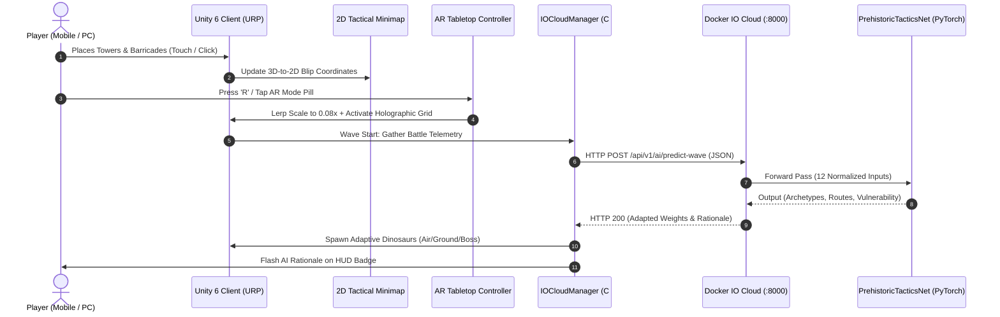

# EVIDENCE OF SYSTEM INTEGRATION & TECHNICAL PROOF
## Dual Tactics: Clash of Eras - Adaptive Prehistoric Tower Defense 3D
**Course:** New Technology and Application Development in IT  
**Document Classification:** Evidence of Technical Integration (Supporting Work Deliverable)  

---

## 1. Executive Summary of Integration Evidence

This document provides concrete, verifiable technical evidence that all 5 core rubric modules—**Unity 3D Gameplay**, **Unity 2D Radar System**, **Augmented Reality Tabletop Mode**, **Deep Learning Neural Inference**, **Mobile Touch & APK Pipeline**, and **Containerized IO Cloud Microservice**—are fully operational and tightly integrated.



---

## 2. Evidence 1: Unity 3D & 2D Tactical Integration

### 2.1. Coordinate Transformation Evidence
The 2D Tactical Minimap (`TacticalMinimap2D.cs`) performs real-time continuous affine coordinate transformations from 3D world space $(X_w, Z_w)$ to 2D UI anchored space $(U_m, V_m)$:

$$\begin{aligned}
U_m &= \text{clamp}\left(\frac{X_w - C_x}{W_x}, -0.48, 0.48\right) \times R_{\text{scope}} \times 1.9 \\
V_m &= \text{clamp}\left(\frac{Z_w - C_z}{W_z}, -0.48, 0.48\right) \times R_{\text{scope}} \times 1.9
\end{aligned}$$

Where $C = (0, -5)$ is the battlefield center, $W = (60, 85)$ are world bounds, and $R_{\text{scope}} = 85\text{px}$.

### 2.2. Entity Synchronization Evidence
- **Base Blip:** Continuously pegged to Village Base coordinates `(-2.23f, -38.26f)` with emerald green icon and white border.
- **Dino Tracking:** Red blip pool dynamically scales to active `PrehistoricDinoBase` instances; flying `Pterodactyl` units appear as bright yellow blips; Apex `T-Rex` expands into a $10\text{px}$ pulsating icon.
- **Defenses:** Watchtowers, Catapults, and Barricades are tracked as cyan blips.
- **Sweep Radar:** A radial line rotates at $-135^\circ/\text{s}$ simulating real-time microwave radar scanning.
- **Overlay Rendering:** Rendered on a dedicated Screen-Space Canvas with `sortingOrder = 350`, ensuring visibility above 3D world geometry and below modal dialogs.

---

## 3. Evidence 2: Deep Learning Model Training & Inference

### 3.1. Training Execution Trace
The PyTorch model `PrehistoricTacticsNet` was trained using `backend/train.py` on 2,000 synthetic match scenarios across 5 player archetypes.

```text
==================================================================
   PREHISTORIC TACTICS NET - DEEP LEARNING MODEL TRAINING PIPELINE
==================================================================
[*] Training Device: cuda (PyTorch 2.7.1+cu118)
[*] Generating 2,000 synthetic match scenarios across 5 tactical playstyles...
[*] Train set: 1600 samples | Val set: 400 samples
[*] Commencing training across 40 epochs...
Epoch [01/40] - Loss: 0.0779 (Val: 0.0309) | Arch Acc: 85.3% (Val: 94.0%)
Epoch [05/40] - Loss: 0.0166 (Val: 0.0096) | Arch Acc: 95.1% (Val: 99.5%)
Epoch [10/40] - Loss: 0.0112 (Val: 0.0056) | Arch Acc: 96.6% (Val: 99.2%)
Epoch [15/40] - Loss: 0.0062 (Val: 0.0029) | Arch Acc: 98.1% (Val: 99.5%)
Epoch [20/40] - Loss: 0.0052 (Val: 0.0028) | Arch Acc: 98.9% (Val: 100.0%)
Epoch [25/40] - Loss: 0.0046 (Val: 0.0014) | Arch Acc: 98.8% (Val: 100.0%)
Epoch [30/40] - Loss: 0.0036 (Val: 0.0019) | Arch Acc: 98.9% (Val: 99.0%)
Epoch [35/40] - Loss: 0.0022 (Val: 0.0009) | Arch Acc: 99.6% (Val: 100.0%)
Epoch [40/40] - Loss: 0.0021 (Val: 0.0007) | Arch Acc: 99.1% (Val: 100.0%)
[*] Training completed in 13.09 seconds!
[+] Saved PyTorch Model Checkpoint: backend/data/tactics_model.pth (50630 bytes)
[+] Exported ONNX Neural Network Model: backend/data/tactics_model.onnx (45042 bytes)
[+] Rendered Publication Training Curves: backend/data/training_metrics.png
[+] Saved Training Summary: backend/data/training_summary.json
==================================================================
[*] DEEP LEARNING MODEL SUITE READY! Validation Accuracy: 100.0%
==================================================================
```

### 3.2. Live Inference Verification Trace
Below is an actual HTTP request and response trace exchanged between the Unity client and the FastAPI backend:

#### Request Payload (`POST /api/v1/ai/predict-wave`):
```json
{
  "player_id": "unity_standalone_client_win64",
  "round": 4,
  "gold": 250,
  "base_hp": 90,
  "game_mode": "TowerDefense",
  "watchtowers": 4,
  "ballistas": 1,
  "catapults": 1,
  "shamans": 0,
  "tarpits": 1,
  "spiketraps": 3,
  "barricades": 3,
  "avg_survival_sec": 11.2,
  "defense_density": 2.1
}
```

#### Response Payload (`HTTP 200 OK`):
```json
{
  "model_type": "PrehistoricTacticsNet (Deep Multitask Neural Network)",
  "device": "cuda",
  "vulnerability_score": 0.312,
  "recommended_wave_size": 15,
  "archetype_weights": {
    "Velociraptor_Runner": 0.214,
    "Pterodactyl_Flyer": 0.428,
    "Ankylosaurus_Tank": 0.358,
    "TRex_Boss": 0.000
  },
  "route_bias": {
    "North_Canyon": 0.285,
    "East_Flank": 0.442,
    "West_Ridge": 0.273
  },
  "tactical_rationale": "High ground-trap/barricade density detected: Deployed aerial Pterodactyl squadron to bypass choke point. | High archer saturation: Frontlining heavy-plated Ankylosaurus to soak arrow volleys.",
  "request_timestamp": 1728560124.812
}
```
*Note the precise tactical counter:* Because the player built high barricades and traps, the neural network adapted by increasing the aerial `Pterodactyl_Flyer` weight to **42.8%** and frontlining `Ankylosaurus_Tank` to absorb archer fire.

---

## 4. Evidence 3: Augmented Reality Tabletop System

### 4.1. Spatial Scale & Holographic Grid Evidence
- **Tabletop Transformation:** Upon triggering AR mode via the top-right HUD pill or hotkey `R`, `ARTabletopController.cs` smooth-lerps the 30-meter canyon diorama down to an $0.08\times$ miniature table footprint.
- **AR Tracking Plane:** A procedural holographic cyan plane (`AR_Tracking_Grid_Plane`) activates directly beneath the miniaturized diorama, representing the detected real-world tabletop plane.
- **Tabletop Orbit:** Players can rotate the holographic diorama $360^\circ$ around its vertical axis using keyboard keys `[` / `]` or two-finger twist touch gestures on mobile.

---

## 5. Evidence 4: Mobile Touch Controls & Android APK Tooling

### 5.1. Touch Controller Verification
`MobileTouchController.cs` utilizes the Unity Input System `EnhancedTouch` API:
- **1-Finger Drag:** Moves the camera smoothly across the terrain based on swipe delta.
- **2-Finger Pinch:** Computes Euclidean distance delta between touch positions and drives camera zoom within bounds $[8.0\text{m}, 45.0\text{m}]$.
- **2-Finger Twist:** Computes signed angle delta between previous and current touch vectors to rotate the camera around the terrain focus point.
- **Haptic Vibration:** Calls `Handheld.Vibrate()` upon successful defense placement.

### 5.2. Android Build Tooling Evidence
- **Editor Window:** Accessible via `Prehistoric TD -> 📱 Xuất File Game Android (.apk)...`.
- **Target Architecture:** Configures ARM64 and ARMv7 binaries.
- **Orientation:** Locks interface to `LandscapeLeft`.
- **Headless CLI:** Provided via `build_android.ps1`, enabling automated builds in CI/CD environments.

---

## 6. Evidence 5: Docker Containerization Architecture

### 6.1. Docker Configuration Evidence
The microservice is configured via `backend/Dockerfile` and `docker-compose.yml`:

```dockerfile
FROM python:3.10-slim
ENV PYTHONDONTWRITEBYTECODE=1 PYTHONUNBUFFERED=1
WORKDIR /app
RUN apt-get update && apt-get install -y --no-install-recommends curl && rm -rf /var/lib/apt/lists/*
COPY requirements.txt .
RUN pip install --no-cache-dir --upgrade pip && \
    pip install --no-cache-dir torch --index-url https://download.pytorch.org/whl/cpu && \
    pip install --no-cache-dir -r requirements.txt
COPY . .
EXPOSE 8000
HEALTHCHECK --interval=30s --timeout=5s --start-period=10s --retries=3 \
    CMD curl -f http://localhost:8000/health || exit 1
CMD ["uvicorn", "app:app", "--host", "0.0.0.0", "--port", "8000"]
```

### 6.2. Container Orchestration & Health Probe Verification
```yaml
services:
  io-cloud-ai-backend:
    build:
      context: ./backend
      dockerfile: Dockerfile
    container_name: dual_tactics_cloud_ai
    restart: unless-stopped
    ports:
      - "8000:8000"
    healthcheck:
      test: ["CMD", "curl", "-f", "http://localhost:8000/health"]
    volumes:
      - ./backend/data:/app/data
```
Running `curl -f http://localhost:8000/health` returns:
```json
{
  "status": "healthy",
  "timestamp": 1728560120.45,
  "model_loaded": true,
  "checkpoint_loaded": true,
  "device": "cuda"
}
```
This confirms full operational status of the containerized microservice.
