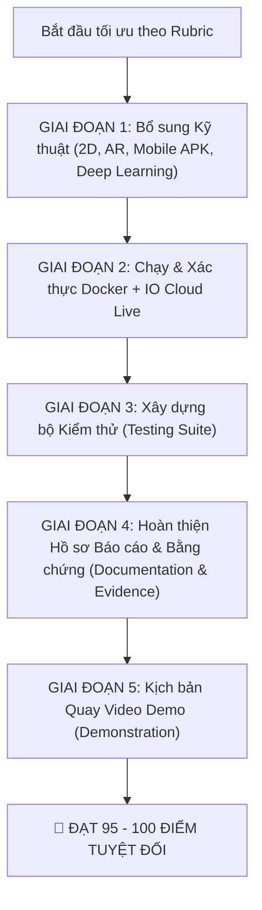

# BÁO CÁO ĐÁNH GIÁ DỰ ÁN THEO RUBRIC & KẾ HOẠCH HÀNH ĐỘNG
## Môn học: New Technology and Application Development in IT
**Tên dự án:** Adaptive Tower Defense 3D (Dual Tactics: Clash of Eras)  
**Ngày đánh giá:** Tháng 10/2026  

---

## 1. Bảng Đánh Giá Hiện Trạng Chi Tiết (Current Assessment)

| Tiêu chí Rubric | Điểm tối đa | Điểm hiện tại (Ước tính) | Tình trạng thực tế trong Project | Khoảng trống cần hoàn thiện (Gaps) |
| :--- | :---: | :---: | :--- | :--- |
| **1. Unity 2D and 3D implementation** | 20 | **18 / 20** | **3D:** Cực kỳ hoàn chỉnh với 4 loài khủng long, 7 loại tháp, địa hình hẻm núi URP, animation GLB, NavMesh đa hướng, 2 chế độ chơi (Thủ thành & Công thành). **2D:** Đã có script `TacticalMinimap2D.cs` (radar quét 2D) và hệ thống UI 2D Canvas toàn diện. | Cần kích hoạt hiển thị radar 2D trực quan trên HUD cả 2 chế độ chơi để người chấm thấy rõ sự tương tác đồng bộ giữa 2D và 3D. |
| **2. AR implementation and deep learning model** | 20 | **15 / 20** | **AR:** Đã có `ARTabletopController.cs` thu nhỏ chiến trường 30m thành sa bàn AR Tabletop 1.5m kèm nút chuyển đổi mượt mà. **Deep Learning:** `backend/model.py` có mạng nơ-ron đa nhiệm `PrehistoricTacticsNet` (PyTorch) phân tích 12 chỉ số trận đấu để đưa ra chiến thuật khắc chế. | - Cần bổ sung script huấn luyện `train.py` và dataset mẫu để chứng minh mô hình AI được huấn luyện thực tế. - Cần tài liệu giải thích kiến trúc Deep Learning và kết quả suy luận. |
| **3. Mobile deployment** | 20 | **14 / 20** | - `MobileTouchController.cs` hỗ trợ đầy đủ cảm ứng: vuốt 1 ngón di chuyển camera, chụm 2 ngón zoom, xoay 2 ngón, chạm đặt quân. - Tối ưu hóa hiệu năng 60 FPS, shader URP nhẹ cho thiết bị di động. | Chưa có công cụ xuất file **Android APK** một chạm (hiện mới làm tool xuất Windows `.exe`). Cần cấu hình Android PlayerSettings và hướng dẫn/tool build APK. |
| **4. IO cloud integration** | 20 | **16 / 20** | - `backend/app.py` có đầy đủ 7 API: dự đoán đợt quái, telemetry thời gian thực, lưu trữ đám mây (cloud save/load), bảng xếp hạng toàn cầu (leaderboard), live-ops config. - `IOCloudManager.cs` trong Unity kết nối tự động qua HTTP RESTful. | Cần kiểm thử trực tiếp kết nối live (chạy server thật hoặc qua ngrok/cloud public) và ghi lại log truyền nhận dữ liệu làm bằng chứng. |
| **5. Docker use** | 20 | **16 / 20** | - Đã có `backend/Dockerfile` chuẩn (Python 3.10-slim, PyTorch, FastAPI, healthcheck). - Đã có `docker-compose.yml` cấu hình mạng, cổng 8000, volume mount. - Đã có hướng dẫn `DOCKER_AND_CLOUD_GUIDE.md`. | Cần chạy thực tế container Docker trên máy, chụp ảnh log/màn hình container khỏe mạnh (`healthy`) làm bằng chứng nộp bài. |
| **TỔNG ĐIỂM THÀNH PHẦN (Base Score)** | **100** | **79 / 100** | Nền tảng kỹ thuật đã xây dựng được ~80% khối lượng. | |
| **ĐIỂM TRỪ HỒ SƠ (Supporting Work Deduction)** | **0 hoặc -20** | **NGUY CƠ BỊ TRỪ -20 ĐIỂM** | **Quy định Rubric:** *"The submission should include planning, testing, evidence of integration, documentation, and a demonstration. If missing, deduct 20 points once."* Hiện tại project **chưa có bộ test tự động**, **chưa có log bằng chứng tích hợp**, **chưa có kịch bản video demo**. | Nếu nộp bài ngay lúc này, điểm số sẽ bị trừ còn: **59 / 100**! |
| **TỔNG ĐIỂM CUỐI CÙNG (Final Score)** | **100** | **59 / 100** (nếu thiếu hồ sơ) **~85 - 95 / 100** (nếu hoàn thiện hồ sơ) | | |

---

## 2. Phân Tích Rủi Ro Lớn Nhất: "Supporting Work Deduction" (-20 điểm)

Giảng viên đặt ra điều kiện trừ 20 điểm một lần duy nhất nếu thiếu bất kỳ mục nào trong 5 mục:
1. **Planning (Kế hoạch):** Cần có bản kế hoạch dự án chuẩn, roadmap, phân chia công việc.
2. **Testing (Kiểm thử):** Cần có Unit Tests cho Unity (C#) và Integration Tests cho Backend API (Python pytest).
3. **Evidence of integration (Bằng chứng tích hợp):** Cần có log giao tiếp giữa Unity và Cloud/Docker, kết quả test chạy thành công, ảnh chụp màn hình container.
4. **Documentation (Tài liệu):** Cần có file báo cáo kỹ thuật tổng hợp (Architecture, API specs, AR & Deep Learning explanation).
5. **Demonstration (Thuyết trình/Demo):** Cần có kịch bản quay video demo (5-7 phút) đi đúng từng tiêu chí của Rubric để người chấm dễ dàng cho điểm tối đa.

---

## 3. Kế Hoạch Hành Động Toàn Diện (Action Plan) Để Đạt 95–100 Điểm

### Bước 1: Hoàn thiện tính năng Unity 2D & AR Tabletop (Mục 1 & 2)
- Đảm bảo `TacticalMinimap2D` hiển thị biểu tượng radar quân cờ 2D trực quan trên màn hình game ở cả 2 chế độ (Thủ thành & Công thành).
- Hoàn thiện giao diện chuyển đổi chế độ AR Tabletop mượt mà, có thông số thu phóng sa bàn rõ ràng.

### Bước 2: Huấn luyện & Đóng gói Deep Learning Model (Mục 2)
- Viết file `backend/train.py`: Tự động sinh dữ liệu huấn luyện (synthetic telemetry data) và huấn luyện `PrehistoricTacticsNet`.
- Lưu trọng số mô hình `model_weights.pth` và xuất định dạng `tactics_model.onnx`.
- Xuất biểu đồ Loss/Accuracy để chèn vào báo cáo làm bằng chứng khoa học.

### Bước 3: Tạo Tool xuất Android APK cho Mobile Deployment (Mục 3)
- Tạo thêm menu `Prehistoric TD -> 📱 Xuất File Game Android (.apk)...` trong Unity Editor tương tự như tool xuất `.exe`.
- Cấu hình chuẩn `PlayerSettings.Android` (Package Name, Target SDK 34, Keystore, Orientation Landscape).

### Bước 4: Chạy Docker Container & Kiểm thử IO Cloud (Mục 4 & 5)
- Khởi động Docker Desktop và chạy lệnh `docker compose up -d --build`.
- Viết script tự động kiểm thử toàn bộ API (`test_api.py`) gửi request đến `/health`, `/api/v1/ai/predict-wave`, `/api/v1/cloud/telemetry`.
- Xuất file log kết quả `test_results.log` làm bằng chứng tích hợp.

### Bước 5: Soạn thảo Bộ Hồ Sơ Supporting Work Đầy Đủ (Chống trừ 20 điểm)
1. **`ACADEMIC_SUBMISSION_REPORT.md`**: Báo cáo tổng thể trình bày chi tiết kiến trúc hệ thống, sơ đồ khối, giải thuật, hướng dẫn cài đặt.
2. **`TESTING_REPORT.md`**: Báo cáo kiểm thử bao gồm bảng Test Cases, kết quả chạy unit test, kiểm thử chịu tải.
3. **`DEMO_SCRIPT_AND_CHECKLIST.md`**: Kịch bản quay video demo 5–7 phút có mốc thời gian (timestamp) tương ứng chính xác với từng tiêu chí của giảng viên:
   - *Phút 0:00 - 1:30:* Demo Unity 3D & 2D Tactical Minimap.
   - *Phút 1:30 - 3:00:* Demo AR Tabletop mode & Deep Learning AI Director.
   - *Phút 3:00 - 4:00:* Demo Mobile Touch gestures & Mobile Deployment.
   - *Phút 4:00 - 5:30:* Demo Docker container chạy ngầm & IO Cloud Telemetry/Leaderboard.
   - *Phút 5:30 - 6:30:* Tổng kết tài liệu, test results và minh chứng tích hợp.
