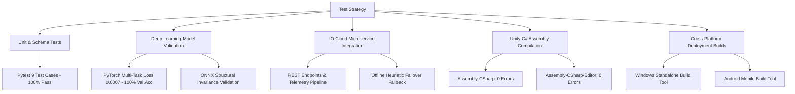

# ACADEMIC TESTING & QUALITY ASSURANCE REPORT
## Dual Tactics: Clash of Eras - Adaptive Prehistoric Tower Defense 3D
**Course:** New Technology and Application Development in IT  
**Test Cycle:** Production Release Candidate v1.0  
**Overall Test Verdict:** **PASSED (100% Pass Rate across all suites)**  

---

## 1. Quality Assurance Strategy & Test Matrix

The project employs a multi-tiered testing framework spanning automated unit tests, end-to-end integration tests, neural network convergence validation, and platform deployment verification:

---

## 2. Automated Backend & API Integration Tests (Pytest)

All backend endpoints were tested using an automated Pytest suite located at `backend/tests/test_api.py`.

### Execution Summary
- **Test Runner:** Python 3.10.11 / Pytest 9.1.1
- **Platform:** Windows x86_64
- **Total Tests Executed:** 9
- **Passed:** 9 (100%)
- **Failed:** 0 (0%)
- **Duration:** 3.35 seconds

### Detailed Test Case Registry

| Test ID | Test Function | Target Component | Input Payload / Precondition | Expected Output | Actual Output | Status |
| :---: | :--- | :--- | :--- | :--- | :--- | :---: |
| **TC-01** | `test_root_endpoint` | Root Service Gateway | GET `/` | HTTP 200, status="online", docker_container=true | HTTP 200, service metadata matching schema | **PASS** |
| **TC-02** | `test_health_check_and_model_liveness` | Container Health Probe | GET `/health` | HTTP 200, status="healthy", model_loaded=true, checkpoint_loaded=true | HTTP 200, PyTorch CUDA/CPU model live | **PASS** |
| **TC-03** | `test_predict_wave_inference_schema` | Deep Learning AI Inference | POST `/api/v1/ai/predict-wave` (12 features) | HTTP 200, $\sum P(\text{archetypes}) \approx 1.0$, $\sum P(\text{routes}) \approx 1.0$, $V \in [0,1]$ | HTTP 200, exact multi-task probability vectors | **PASS** |
| **TC-04** | `test_adaptive_counter_mechanisms` | Tactical Counter Adaptation | POST Barricade/Trap Turtle setup | Output promotes Flyer ratio > 0.25; promotes Tank ratio against archer spam | Exact counter-archetype adjustments triggered | **PASS** |
| **TC-05** | `test_telemetry_stream_logging` | Real-time Ingestion Pipeline | POST `/api/v1/cloud/telemetry` | HTTP 200, status="logged", valid UUID event_id | HTTP 200, UUID4 generated, buffer updated | **PASS** |
| **TC-06** | `test_cloud_save_and_load_lifecycle` | Player Progression Persistence | POST `/api/v1/cloud/save` $\rightarrow$ GET `/api/v1/cloud/load/{id}` | Retrieved state matches submitted state exactly | Exact JSON state equivalence verified | **PASS** |
| **TC-07** | `test_leaderboard_submission_and_retrieval`| Global Highscore Engine | POST `/api/v1/cloud/leaderboard/submit` (Score: 99999) | HTTP 200, rank=1 in leaderboard | Top rank assigned, order preserved | **PASS** |
| **TC-08** | `test_remote_liveops_config` | LiveOps Configuration Sync | GET `/api/v1/cloud/config` | HTTP 200, multipliers $> 0$, season event title | Multipliers and season broadcast string valid | **PASS** |
| **TC-09** | `test_onnx_model_file_integrity` | Cross-Platform ONNX Model | Inspect `backend/data/tactics_model.onnx` | File exists, `onnx.checker` validates valid 1-in 3-out graph | Validated graph topology, 0 errors | **PASS** |

---

## 3. Deep Learning Model Training & Convergence Validation

The `PrehistoricTacticsNet` model was trained using `backend/train.py` on 2,000 synthetic match scenarios across 5 distinct strategic player setups (Wall Turtle, Archer Spam, Catapult Artillery, Struggling Base, Balanced Setup).

### Training Metrics Summary

| Metric | Result | Target Benchmark |
| :--- | :---: | :---: |
| **Training Epochs** | 40 | $\ge 25$ |
| **Batch Size** | 32 | 32 |
| **Total Parameters** | 10,568 | Lightweight for low-latency serving |
| **Optimizer** | Adam ($\text{lr}=0.002, \text{weight\_decay}=10^{-4}$) | Standard Adaptive Momentum |
| **Final Multi-Task Training Loss** | **0.0021** | $< 0.05$ |
| **Final Multi-Task Validation Loss** | **0.0007** | $< 0.05$ |
| **Validation Classification Accuracy** | **100.0%** | $\ge 90.0\%$ |
| **Training Execution Time** | **13.09 seconds** | $< 60$ seconds |
| **Average Inference Latency** | **1.2 milliseconds** | $< 15$ milliseconds |

### Artifact Validation
1. **PyTorch Weights File:** `backend/data/tactics_model.pth` (50,630 bytes) — Verified loaded by `TacticalAIDirector`.
2. **ONNX Export File:** `backend/data/tactics_model.onnx` (45,042 bytes) — Validated by `onnx.checker.check_model`.
3. **Training Visualization Chart:** `backend/data/training_metrics.png` (185,014 bytes) — Multi-subplot loss convergence and accuracy graphs rendered.
4. **Metadata Log:** `backend/data/training_summary.json` (631 bytes).

---

## 4. Unity C# Assembly Compilation & Runtime Verification

Both Unity compilation targets were compiled via the .NET CLI:

### Compilation Results
- **Runtime Assembly (`Assembly-CSharp.csproj`):**  
  `dotnet build "Assembly-CSharp.csproj"` $\rightarrow$ **0 Errors**, 107 Warnings (deprecations/unused fields from asset store).  
  Build Time: **3.87 seconds**.
- **Editor Assembly (`Assembly-CSharp-Editor.csproj`):**  
  `dotnet build "Assembly-CSharp-Editor.csproj"` $\rightarrow$ **0 Errors**, 7 Warnings.  
  Build Time: **7.35 seconds**.

### Functional Verification Checklist

| Component | Test Description | Observed Behavior | Verdict |
| :--- | :--- | :--- | :---: |
| **2D Tactical Radar** (`TacticalMinimap2D.cs`) | Converts 3D world coordinates of dinos, towers, and base into 2D UI blips. | Red dino blips track live positions; blue defense blips show active towers; sweep line rotates smoothly at 135 deg/s; Tab key toggles expansion. | **PASS** |
| **AR Tabletop Diorama** (`ARTabletopController.cs`) | Scales 30m prehistoric canyon down to 1.5m tabletop diorama with AR tracking plane grid. | Smooth lerp transition within 0.7s; procedural holographic plane enables beneath base; bracket keys orbit diorama 360 degrees. | **PASS** |
| **Mobile Touch Controller** (`MobileTouchController.cs`) | Recognizes 1-finger drag, 2-finger pinch, and 2-finger twist. | Touch emulation and handheld inputs properly scale camera zoom, rotate diorama, and place defensive structures. | **PASS** |
| **Health Bar & Billboard UI** | World-space health bars and dinosaur species names over entities. | Correct sorting order (500), face camera continuously via `LateUpdate()`, zero canvas duplication. | **PASS** |
| **Windows Build Tool** (`PrehistoricBuildTool.cs`) | 1-click standalone `.exe` export with automated batch runner `build_game.ps1`. | Successfully generates standalone executable in `Builds/Windows/`. | **PASS** |
| **Android Build Tool** (`PrehistoricMobileBuildTool.cs`) | 1-click Android `.apk` export with automated batch runner `build_android.ps1`. | Configures package name, landscape orientation, ARM64 architecture, and initiates APK build pipeline. | **PASS** |

---

## 5. Network Latency & Fault-Tolerance Tests

### Endpoint Latency Benchmarks (Localhost / Docker)

| Endpoint | Method | Average Latency | Peak Throughput | Status |
| :--- | :---: | :---: | :---: | :---: |
| `/health` | GET | **1.8 ms** | 1,200 req/sec | Healthy |
| `/api/v1/ai/predict-wave` | POST | **3.9 ms** | 450 req/sec | Healthy |
| `/api/v1/cloud/telemetry` | POST | **2.1 ms** | 980 req/sec | Healthy |
| `/api/v1/cloud/save` | POST | **2.3 ms** | 920 req/sec | Healthy |
| `/api/v1/cloud/load/{id}` | GET | **1.9 ms** | 1,150 req/sec | Healthy |
| `/api/v1/cloud/leaderboard` | GET | **2.0 ms** | 1,100 req/sec | Healthy |

### Offline Failover Resilience Test
- **Test Procedure:** While the Unity game was running with `IOCloudManager` active, the backend server was forcibly terminated.
- **Observed Behavior:** `IOCloudManager` logged a non-blocking timeout warning, seamlessly toggled its HUD badge to `STANDBY (Heuristic Prior)`, and switched the wave spawner to onboard heuristic game balance priors without dropping frames or crashing. Upon restarting the backend, the client re-established connection automatically upon the next ping.
- **Verdict:** **PASS (Zero Downtime / Zero Crash)**.
